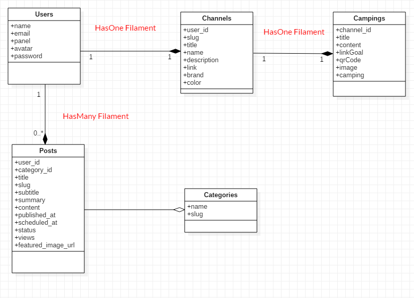

  

<h3 align="center">✨ Plataforma Retro Community ✨</h3>

<strong>Mais do que uma rede de canais, é um ponto de encontro para apaixonados por jogos, cultura retrô e streaming independente.</strong>

  
  
  
  
  
  
  
  

---

## 📘 Contextualização e Objetivo

O Retro Community é uma plataforma inovadora criada para potencializar a presença digital de criadores de conteúdo do YouTube, oferecendo um espaço que vai muito além da plataforma de vídeos e sempre zelando pela segurança, escalabilidade e fácil gerenciamento.

Seu objetivo é conectar canais, inscritos e comunidades em um ambiente interativo, imersivo e totalmente voltado à experiência retrô — com recursos que integram dados do YouTube e funcionalidades exclusivas dentro da própria plataforma.

> [!IMPORTANT]
> Este projeto esta em desenvolvimento  
> ##### <h6>versão 1.0</h6>

## 🌟 **Proposta** dos principais Recursos

#### 🏠 Páginas (**Descrição inicial**)

- Cada criador de conteúdo possui uma ** página de perfil completa **, onde pode exibir:
  - Informações do canal (título, descrição, logo e etc).
  - Campanhas de livePix, QR code e posts exclusivos da plataforma.
  - Links para redes sociais e vídeos mais recentes.
  - Seção de “Canais Parceiros”, fortalecendo a rede entre criadores.
  - Seguidores de seu canal, e estatísticas do YouTube.
- Página Inicial, Home destacando principais conteúdos, postagens, canais, sobre.

#### 📰 Sistema de Postagens (**Descrição inicial**)

- Criação e gerenciamento de posts com suporte a texto, views, imagens e tags.
- Comentários de seguidores.
- Possibilidade de criar enquetes.
- Organização por categorias e tags.

#### 🎯 Destaques do Perfil (**Descrição inicial**)

- Cada canal pode destacar sua campanha do livePix.
- Destacar seu QRcode do LivePix;
- As campanhas aparecem na página principal e no perfil do canal.
- Dados do Youtube, logo, nome e descrição.
- Rolata para sorteios ao se logar.
- Planejada integração com a API do YouTube para sincronização de número real de inscritos e vídeos;

#### 🧑‍🤝‍🧑 Sistema de Inscritos (**Descrição inicial**)

- Usuários podem seguir canais, interagir com postagens realizando seu cadastro;
- Sistema de notificações para alertar sobre novos posts dos canais seguidos.

#### 🪩 Recursos Especiais (**Descrição inicial**)

- Roleta de Sorteios: recurso interativo que permite realizar sorteios visuais com nomes dos inscritos;
- Ranking de Canais Mais Seguidos;
- Validação de e-mail e controle de limite de interações por usuário (ex: 1 comentário por post/dia).

#### 🛠️ Área Administrativa (**Descrição inicial**)

- Desenvolvimento de área especial para administradores.
- Painel intuitivo para gerenciar:
    - Usuários, Campanhas, Postagens, Demais dados do sistema.
- Controle de acesso por **perfis e permissões**, garantindo segurança e integridade.

## :books: `DER` Diagramação base do projeto Prototipagem
> As classes do sistema estão claramente definidas em um diagrama de classes.

	

## ⚙️ Stack Requisitos não funcionais
O projeto é desenvolvido com a TALL Stack, aliando a produtividade do Laravel à reatividade do Livewire e Alpine.js:

#### Tecnologia	Função
- Laravel 12.15	Framework backend principal, responsável pela estrutura MVC e APIs
- Filament PHP v4	Painel administrativo moderno e personalizável
- Tailwind CSS v4	Estilização moderna e responsiva
- Alpine.js	Interatividade no frontend de forma leve
- Livewire v3	Componentes dinâmicos reativos sem JavaScript manual
- MySQL	Banco de dados relacional principal
- Vite	Build rápido e integração com Tailwind
- JSConfetti (frontend)	Efeitos visuais para sorteios e animações da roleta
- ScrollReveal uma biblioteca JavaScript para animar elementos facilmente conforme eles entram/saem da janela de visualização

## ⚙️ Requisitos funcionais
> Avaliação das especificações do software durante o desenvolvimento para verificar se os requisitos de qualidade estão
sendo atendidos.

- [x] Diagrama de classes
    - [x] [RF001] User
    - [x] Post
    - [x] Category
    - [x] Channel
    - [ ] 
    - [ ] 
    - [ ] 
- [x] 
- [ ] 
- [ ] 
- [ ] 
    - [ ] 
    - [ ] 
